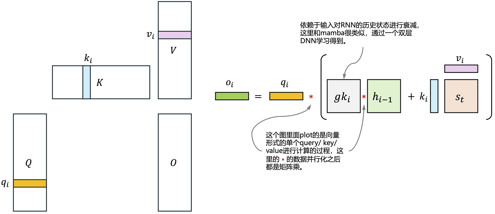

# [Gated Linear Attention Transformers with Hardware-Efficient Training](https://arxiv.org/pdf/2312.06635)

这一段[naive的GLA recurrent form代码](https://github.com/lcy-seso/flash-linear-attention/blob/exp/fla/ops/gla/naive.py#L35)能够直观地看出来GLA以recurrent方式计算时如何计算。

- $B$: batch size
- $H$: head number
- $d_k$：query和key的hidden dimension，这两者的维度相同
- $d_v$: value的hidden dimension

|notation|shape|说明|
|:--:|:--:|:--|
|$\gamma$|$[1,]$|一个常量因子， $\gamma=\frac{1}{\sqrt{d_k}}$|
|$q_i$|$[B,H,d_k,1]$|时间步$i$一个query token的表示，当多个query和多个head一起运算的时候被组成为一个$3d$ tensor|
|$k_i$|$[B,H,d_k,1]$|时间步$i$一个key token的表示，当多个query和多个head一起运算的时候被组成为一个$3d$ tensor|
|$v_i$|$[B,H,1,d_v]$|时间步$i$一个value token的表示，当多个query和多个head一起运算的时候被组成为一个$3d$ tensor|
|${gk}_i$|$[B,H,d_k，1]$|时间步$i$ key的gate factor。${gk}$的形状和key的形状相同|
|$h_{i-1}$|$[B,H,d_k,d_v]$|与RNN非常类似，上一时间步的状态，初始化为0|
|$o_{i}$|$[B,H,d_v]$|时间步$i$的输出，$O$与value的形状相同|

我们把GLA看做是一个RNN cell（causal形式，不attend到未来时刻，$i$时刻只去attend$i$时刻之前），这个cell由以下公式计算得到：

$$o_i = \text{sum} \left( q_i * \gamma * \left(h_{t-1} * \exp \left( {gk}_i \right)  + k_i \otimes v_i \right), \text{dim}=-2 \right)$$

<p align="center">
<br>
Fig. GLA单个query/key/value的计算过程
</p>

论文的[v3 版本](https://arxiv.org/pdf/2312.06635v3)中图对GLA layer地解释更为简洁。

<p align="center">
<br>
Fig. GLA layer
</p>

下面的表格列出来每一步计算的形状变化：

```python
for i in range(L): # L是序列长度
    o_i = GLA_cell(q_i, k_i, v_i, gk_i, scale)
```

|No.|Equation|形状映射|
|:--:|:--|:--|
|1|$v_1 = q_i * \gamma$|$[B,H,d_k,1]*[1,] \longrightarrow [B,H,d_k,1]$|
|2|$v_2 = \exp \left( {gk}_i \right)$|$[B,H,d_k,1] \longrightarrow [B,H,d_k,1]$
|3|${kv}_i = k_i \otimes v_i$  | $[B,H,d_k,1]\otimes [B,H,1,d_v]\longrightarrow [B,H,d_k,d_v]$|
|4|$h_i = h_{i-1} * v_2 + {kv}_i$|$[B,H,d_k,d_v]*[B,H,d_k,1]+[B,H,d_k,d_v] \longrightarrow [B,H,d_k,d_v]$
|5|$o_i=\text{sum}\left( v_1 *h_i \, \text{dim}=-2 \right)$|$[B,H,d_k,1]*[B,H,d_k,d_v] \longrightarrow [B,H,d_v]$

# References

1. [Transformer Quality in Linear Time](https://proceedings.mlr.press/v162/hua22a/hua22a.pdf)
1. [Sampled Softmax with Random Fourier Features](https://arxiv.org/pdf/1907.10747)
