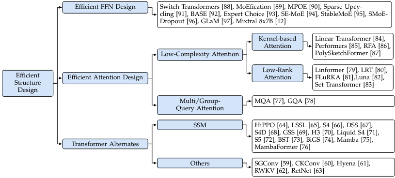

 

- [LongNet: Scaling Transformers to 1,000,000,000 Tokens](https://arxiv.org/abs/2307.02486)
  (github上面代码好乱，没搞明白)

- [Reformer: The Efficient Transformer](https://arxiv.org/abs/2001.04451)
  （由于我们只关心核心计算部分，算法的idea过于复杂）

- Linear Transformer: [Transformers are rnns: Fast autoregressive transformers with linear attention](https://proceedings.mlr.press/v119/katharopoulos20a/katharopoulos20a.pdf)
    - https://linear-transformers.com/
    - ***2018年***，[efficient attention](https://github.com/cmsflash/efficient-attention) (这个复杂度的适合分析和进一步设计)

- 2020年，Performer: [Rethinking attention with performers](https://arxiv.org/pdf/2009.14794) [[GoogleAI Blog]](https://research.google/blog/rethinking-attention-with-performers/)
    - [github](https://github.com/google-research/google-research/tree/master/performer/fast_attention)

- ***2021年***，[Random Feature Attention](https://arxiv.org/abs/2103.02143)
  - [github](https://github.com/Noahs-ARK/RFA)（这个实现比较简单，适合研究和实验）

- ***2023年***，[PolySketchFormer: Fast Transformers via Sketching Polynomial Kernels](https://arxiv.org/pdf/2310.01655)
  - [github](https://github.com/google-research/google-research/tree/master/polysketchformer)（这个优点是比较新）

## Sparse Attention

### Static sparse attention

Remove activations independent of inputs.

- ~~sparse transformer [Generating Long Sequences with Sparse Transformers](https://arxiv.org/abs/1904.10509)~~
    - 供我们进行实验的基础不好，基于一个非常古老的库

- ~~[2020年]：Longerformer: [Longformer: The Long-Document Transformer](https://arxiv.org/abs/2004.05150)~~
  - [github](https://github.com/allenai/longformer)

- [2024年]：streaming LLM: [Efficient Streaming Language Models with Attention Sinks](https://arxiv.org/pdf/2309.17453)
  - [github](https://github.com/mit-han-lab/streaming-llm)

- [2020年]：BigBird: [Big Bird: Transformers for Longer Sequences](https://arxiv.org/abs/2007.14062)

### Dynamic sparse attention

- [2021年]，[Spatten: Efficient sparse attention architecture with cascade token and head pruning](https://arxiv.org/pdf/2012.09852)
  - [github](https://github.com/mit-han-lab/spatten-llm) 这个工作claim自己是一个software-hardware co-design 

- [2023年]，Adaptively sparse attention: [Dynamic context pruning for efficient and interpretable autoregressive transformers](https://arxiv.org/abs/2305.15805)
  - [github](https://github.com/sanagno/adaptively_sparse_attention/tree/main)

- [2023年]，[Faster causal attention over large sequences through sparse flash attention](https://arxiv.org/pdf/2306.01160)
  - [github](https://github.com/epfml/dynamic-sparse-flash-attention/tree/main)，基于triton的实现

- [Efficient content-based sparse attention with routing transformers](https://arxiv.org/pdf/2003.05997)
  - [github](https://github.com/google-research/google-research/tree/master/routing_transformer)

## MQA & GQA

- MQA: [Fast transformer decoding: One write-head is all you need](https://arxiv.org/pdf/1911.02150)
- [Gqa: Training generalized multi-query trans- former models from multi-head checkpoints](https://arxiv.org/pdf/2305.13245)

## Selected Ones

- effiecient attention
  - [ ] 2018，[efficient attention](https://github.com/cmsflash/efficient-attention), 是一种linear transformer
  - [ ] 2021，RFA

- 静态稀疏attention
  - [ ] 2024，streaming LLM：静态稀疏attention

- 动态稀疏attention
  - [ ] 2023, adaptively sparse attention: 动态稀疏attention
  - [ ] 2021，spatten: software-hardware co-design，动态稀疏attention
  - [ ] 2023，sparse flash attention: extend flash attention to sparse attention，动态sparse attention